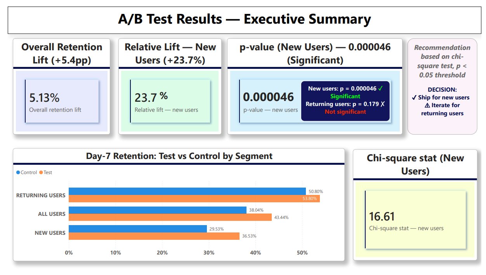
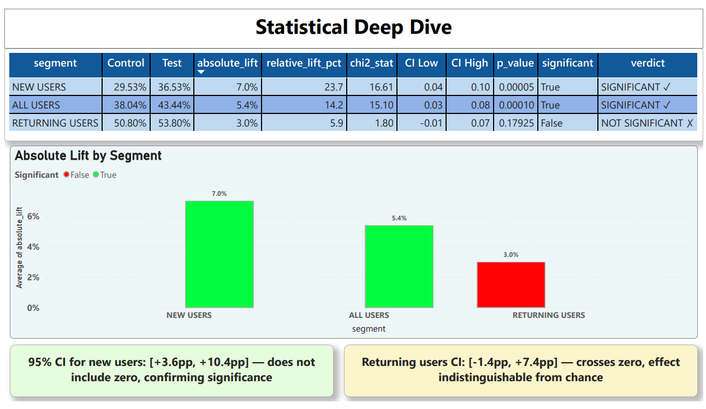
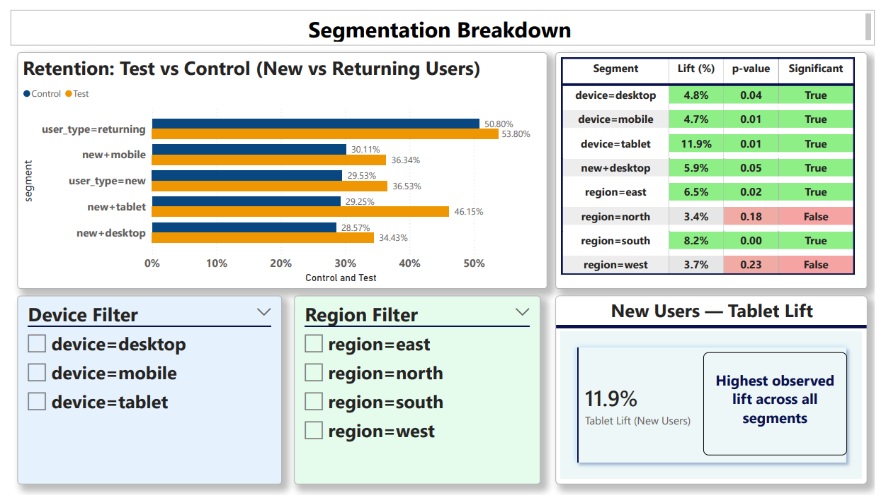
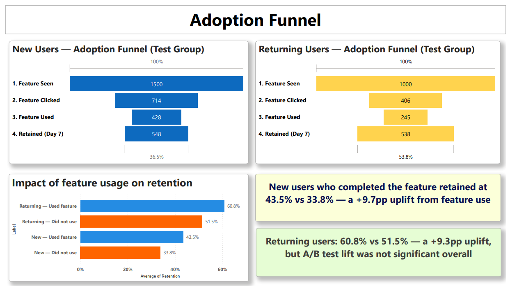

# 📊 Product Feature Adoption & A/B Test Analysis
> A feature drove significant retention gains for new users — but showed no real impact for returning users.  
> This project demonstrates how segmentation transforms a simple A/B test into a product decision.

## Overview
Designed and analyzed a full A/B experiment on product feature adoption, from hypothesis design to statistical testing to a segmented ship/iterate decision memo, using Python and Power BI.

## Key Finding
- New users: **+23.7% relative lift** in Day-7 retention (p = 0.000046) ✓ Significant
- Returning users: +5.9% lift (p = 0.179) ✗ Not significant
- Decision: **Ship for new users. Iterate for returning users.**

## 🎯 Final Decision

This analysis goes beyond measuring uplift — it evaluates **where**, **for whom**, and **whether** the feature should be shipped.

- ✅ Ship for new users  
- ⚠ Iterate for returning users  
- ❌ Do not roll out universally without segmentation  

This ensures data-driven and context-aware product decisions.

  

## 📝 Methodology

- A/B testing with **Control vs Test groups**
- **Chi-square hypothesis testing**
- **95% Confidence Intervals (CI)**
- Segmentation analysis across:
  - User type (new vs returning)
  - Device (desktop, mobile, tablet)
  - Region
- Funnel analysis for feature adoption behavior

---
## 🧪 **Experiment Design**

This experiment simulates a controlled A/B test to evaluate the impact of a new product feature on 7-day user retention.

- **Hypothesis:** The new feature improves Day-7 retention
- **Control Group:** Users without feature exposure
- **Test Group:** Users exposed to the feature
- **Primary Metric:** Day-7 retention rate
- **Minimum Detectable Effect (MDE):** ~5% absolute lift  
  (Chosen as a practically meaningful improvement for product decisions)

## 📋 Assumptions

- Users are randomly assigned to control and test groups  
- Observations are independent across users  
- Sample size (~5000 users) is sufficient for chi-square test validity  
- No major external factors influencing user behavior during the experiment  

These assumptions ensure the statistical results are valid and interpretable.

## 📈 Statistical Interpretation

- **New Users:**  
  95% CI: [+3.6pp, +10.4pp]  
  → Does NOT include zero → effect is statistically significant  

- **Returning Users:**  
  95% CI: [-1.4pp, +7.4pp]  
  → Includes zero → effect is NOT statistically distinguishable from no impact  

This confirms that the observed lift for new users is reliable, while for returning users it may be due to random variation.

---
## 💡Business Impact

- A +23.7% relative lift in retention for new users suggests strong early-stage engagement improvement  
- If scaled, this could significantly increase user activation and long-term retention (LTV)  
- No significant impact on returning users indicates the feature may not improve behavior for already engaged users  

👉 Strategic takeaway:  
Roll out the feature for new users to maximize growth impact, while iterating on experience for returning users.

---
## 🔎 Deeper Product Insight

Although users who engage with the feature show higher retention, the overall effect for returning users is not statistically significant.

This suggests:
- Possible behavioral differences between new and returning users  
- Feature may be more effective during onboarding than for habitual usage  
- Potential selection bias — more engaged users are more likely to use the feature
  
👉 Key takeaway:  
Not all statistically significant results translate into universal product wins, segmentation is critical to avoid misleading aggregate conclusions. 

👉 Implication:  
The feature is likely an **activation driver**, not a **retention enhancer** for mature users.

---
## 📈 Dashboard Preview

### Executive Summary


### Statistical Deep Dive


### Segmentation Breakdown


### Adoption Funnel


## 📊 **View Dashboard (No Power BI required):** [Open PDF](./outputs/AB_Test_Dashboard.pdf)
### 📥 [Download Power BI Dashboard (.pbix)](https://drive.google.com/file/d/1uTDF4gmt2eBWq7VLDVz7wvWJI9ZE8Fr7/view?usp=sharing)
---

## 📊 Key Metrics Tracked

- Retention rate (control vs test)
- Absolute lift
- Relative lift (%)
- p-value (statistical significance)
- Chi-square statistic
- Confidence intervals (CI)

---

## 📊 Dashboard Structure (Power BI)

### 1. Executive Summary
- KPI cards (Retention lift, p-value, relative lift)
- Retention comparison chart
- Decision callout

### 2. Statistical Deep Dive
- Segment-wise statistical results
- Significance visualization
- Confidence interval interpretation

### 3. Segmentation Breakdown
- Performance across devices and regions
- Interactive filters (device, region)
- Highlight: highest lift segment

### 4. Adoption Funnel
- Feature usage funnel (New vs Returning users)
- Impact of feature usage on retention

---

## 🛠 Tools & Technologies

- **Python** → Data simulation & statistical analysis  
- **Power BI** → Dashboard & visualization  
- **CSV / Excel** → Data handling  
- **Git & GitHub** → Version control
- 


---

## Project Structure
| File_Type | File_Name | Description |
| --- | --- | --- |
| Directory | P2_AB_Test_Analysis/ | Main project directory |
| File | ab_test_data.csv | 5000-row simulated dataset |
| Directory | outputs/ | Output results directory |
| File | stats_results.csv | Chi-square results + p-values |
| File | segment_results.csv | New vs returning + device + region |
| File | funnel_results.csv | Adoption funnel data |
| File | 01_experiment_design.md | Hypothesis + test design |
| File | 02_simulate_dataset.py | Data generation script |
| File | 03_statistical_analysis.py | Chi-square + CI analysis |
| File | 04_segmentation_analysis.py | Segment breakdown |
| File | 05_funnel_analysis.py | Funnel drop-off analysis |
| File | 06_visualizations.py | All chart exports |
| File | 07_decision_memo.md | Ship/iterate recommendation |
## How to Run
```bash
pip install pandas scipy matplotlib numpy
python 02_simulate_dataset.py
python 03_statistical_analysis.py
python 04_segmentation_analysis.py
python 05_funnel_analysis.py
python 06_visualizations.py
```


## 🚀 How to Use Dashboard

1. Download the `.pbix` file  
2. Open in Power BI Desktop  
3. Explore the dashboard interactively  

---

## 📌 Key Learning

Statistical significance is critical in product decisions.  
A visible lift in metrics does not always imply a meaningful impact — **validation through hypothesis testing is essential**.

## ⚠ Limitations & Next Steps

While the experiment provides strong directional insights, a few limitations should be considered:

- Simulated dataset may not capture all real-world behavioral variability  
- External factors (seasonality, product changes) are not modeled  
- Feature exposure intensity is not controlled (binary exposure vs actual usage depth)

### Next Steps

- Run experiment on real production data  
- Test feature variations for returning users  
- Analyze long-term retention (Day-14 / Day-30)  
- Explore causal drivers behind feature adoption  

👉 This ensures the analysis evolves from **insight → iteration → product strategy**

---
## Results Summary

| Segment | Control | Test | Lift | p-value | Significant |
|---|---|---|---|---|---|
| All users | 38.0% | 43.4% | +14.2% | 0.0001 | ✓ |
| New users | 29.5% | 36.5% | +23.7% | 0.000046 | ✓ |
| Returning users | 50.8% | 53.8% | +5.9% | 0.179 | ✗ |
---

## 🤝 Let’s Connect

Interested in product analytics, experimentation, or data-driven product decisions?  
I’m always open to meaningful conversations, feedback, or collaboration opportunities.

- LinkedIn: https://www.linkedin.com/in/workwitheesha/
- Email: workwitheesha@gmail.com

